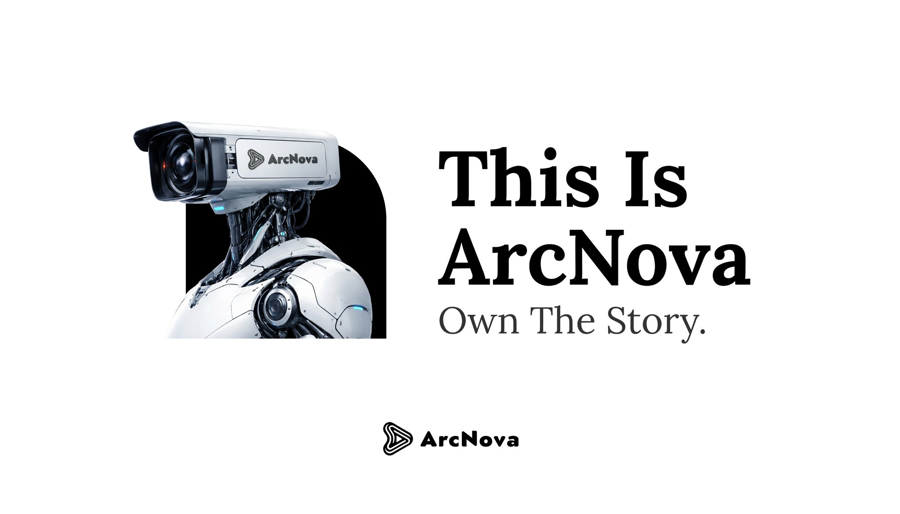

# What is ArcNova?

<figure><figcaption></figcaption></figure>

ArcNova is an AI-native entertainment platform focused on short-form cinematic content and AI-generated dramas.

ArcNova is an AI-native entertainment platform focused on short-form cinematic content and AI-generated dramas.

It provides creators with tools to transform ideas into stories, stories into scenes, and scenes into publishable video content. Instead of only offering a single AI generation feature, ArcNova is designed as a full creative workflow that supports content creation from the first prompt to audience distribution.

ArcNova combines:

* AI video generation
* AI-assisted script creation
* Digital actors
* Voice and character workflows
* Cinematic production tools
* Short-form drama creation
* Content publishing
* Content distribution
* Creator monetization infrastructure

ArcNova is built for a future where high-quality storytelling is no longer limited by production budgets, studio access, or technical barriers.
