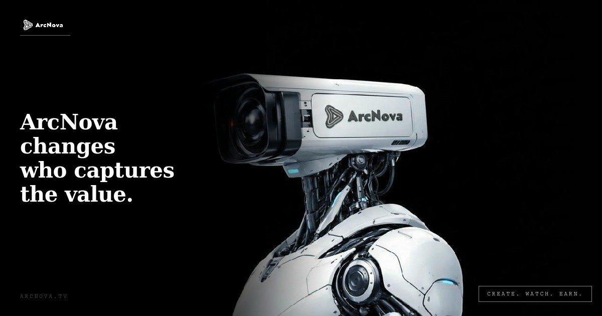

# Welcome to ArcNova

<figure><figcaption></figcaption></figure>

ArcNova is an AI-native cinematic platform built for the next generation of digital storytelling.

The platform helps creators produce, publish, distribute, and monetize AI-powered cinematic content through an integrated product experience. ArcNova is designed for creators, storytellers, creative communities, and audiences who are ready to explore a new form of AI-enabled entertainment.

ArcNova brings together AI creation tools, digital actors, cinematic workflows, short-form drama formats, and content distribution into one connected platform.

Our goal is simple: make cinematic storytelling easier, faster, and more accessible for everyone.

* Website: [arcnova.tv](https://arcnova.tv)
* X: [@ArcNova\_ACI](https://x.com/ArcNova_ACI)
* Discord: [Join our Discord](https://discord.gg/G2BXV5MWDa)
* Telegram: [ArcNova\_AI](https://t.me/ArcNova_AI)
* ArcNova App: [Download](https://arcnova.tv/en/download)
