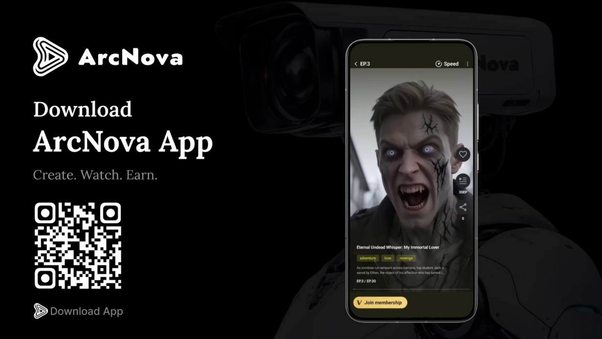

# Mobile Experience

<figure><figcaption></figcaption></figure>

ArcNova is designed for mobile-first entertainment behavior.

Many users discover, watch, and share short-form content through mobile devices. ArcNova’s product experience is built around this behavior by supporting short-form storytelling, creator participation, and viewer engagement.

The mobile experience is important for both sides of the platform:

* Creators need simple tools to create and manage content.
* Viewers need an easy way to discover and watch AI-generated stories.

ArcNova aims to make AI-native entertainment accessible wherever users are.
